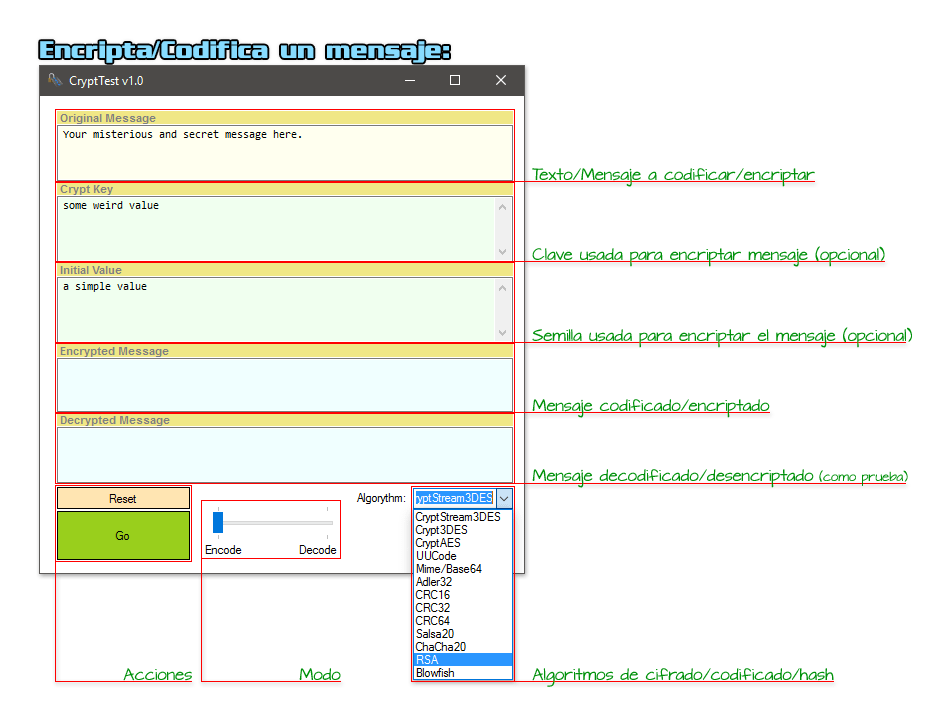
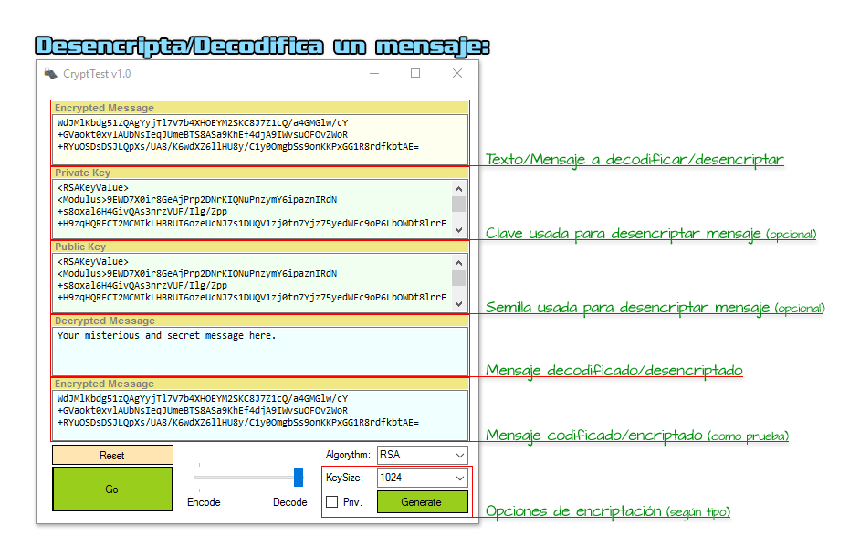
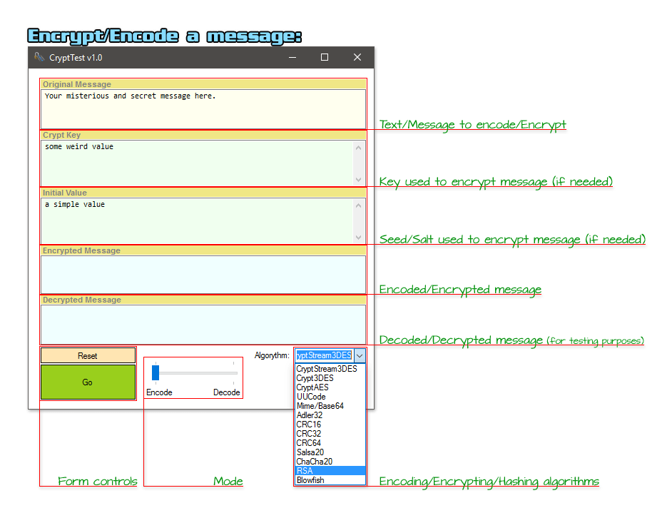
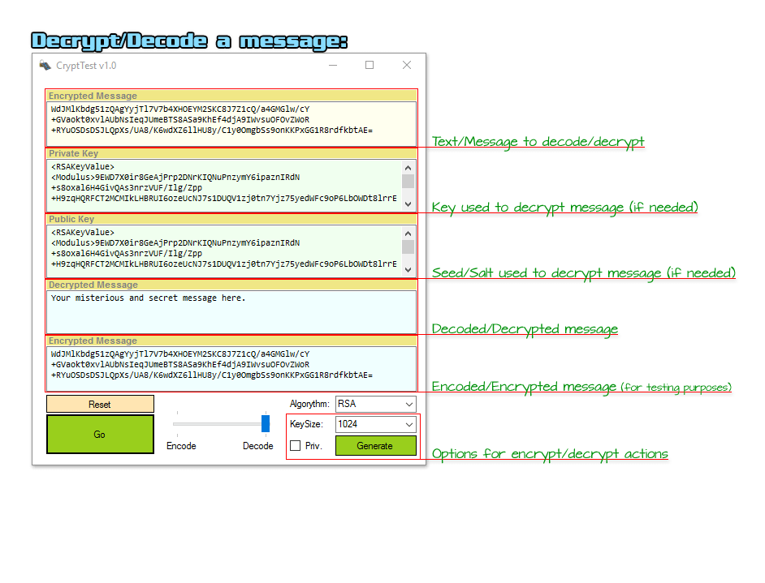
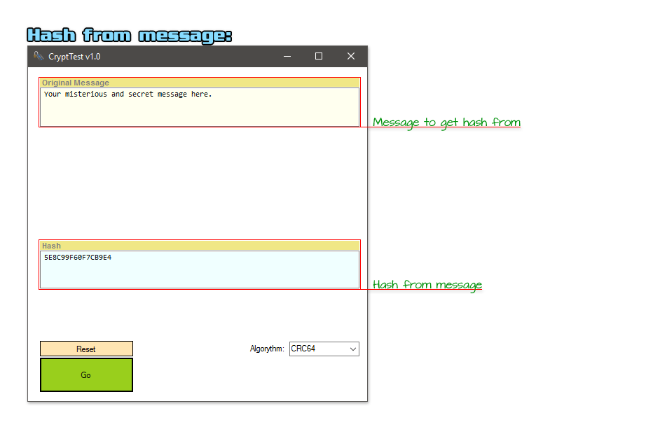

# CryptTest v1.0

------------------------------------ 
        (Spanish / Español)* 
------------------------------------ 
* English version below

> ¿Qué es este programa?

Son pruebas de encriptado/codificado/hash mediante varios algoritmos, con la idea de reutilizarlos en otros proyectos que me surjan.

Con la aplicación se pueden hacer pruebas con varios algoritmos, asignando valores personalizados y comprobando las dos direcciones del proceso.

Los algoritmos implementados son:

- Encriptación: 3DES (simple y con streams), AES, Blowfish, ChaCha20, Salsa y RSA
- Codificación: Base64 y UUEncode/UUDecode
- Hashes: Adler32, CRC16, CRC32 y CRC64

> ¿Es difícil de usar?

La aplicación para hacer pruebas, no :) El código, si se quiere reutilizar, hay que cambiar el namespace para adaptarlo al proyecto en que se usen las "librerías".

Ejemplos de la interfaz:

En el caso de encriptación/codificación, el último paso se obtiene aplicando el algoritmo sobre el mensaje obtenido, para comprobar que se corresponde con el original.

Al igual que antes, para desencriptación/decodificación, el último paso se obtiene aplicando el algoritmo sobre el mensaje obtenido, para comprobar que se corresponde con el original.

------------------------------------
         (English / Inglés)
------------------------------------

> What is this tool?

It is a test on encryption/encoding/hashing using different algorithms. I could use them in other proyects in the future.

You can do tests with the UI, using algorithms and choosing their parameters. Both directions are supported: encoding / decoding and/or encrypting / decrypting.

Included algorithms are:

- Crypt: 3DES (simple and using streams), AES, Blowfish, ChaCha20, Salsa and RSA
- Encoding: Base64 and UUEncode/UUDecode
- Hashes: Adler32, CRC16, CRC32 and CRC64

> Is it hard to use?

Not the tool :D  About source code (in example, to re-use it in other proyects), it is necessary to update namespaces to adapt them to the new proyect.

UI examples:

For encryption/encoding, the last step is done using the algorithm over the resulting message, to check if it matches the original one

For decryption/decoding, the last step is done using the algorithm over the resulting message, to check if it matches the original one

